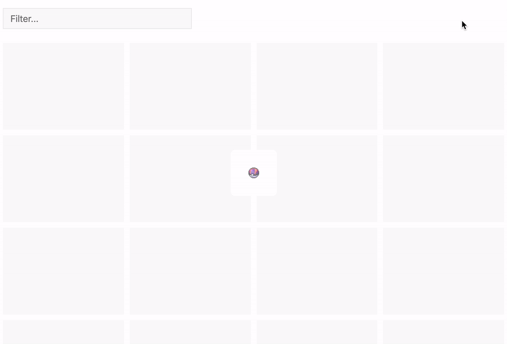

# General Notes

The tasks you need to complete are outlined in this file. We would like to see you do as much as you can, but you don't need to finish every one. Please spend no more than **4 hours** on this assignment.

There are no intentional tricks in this project. The only things you need to complete are outlined in this file, and we believe we have given you every tool you need to complete them. If something else isn't working you can leave a comment or a note, and skip it. 

You should not need to add any dependencies outside of what is being used in this project. That being said - if something feels weird to you, feel free to fix it. But please [document your change](../notes.md), and keep in mind **we will be extra critical of additional changes or dependencies added**.

Finally, being able to communicate well is very important at MetaLab. We will be looking at your **commit history** and **code quality**. Please squash your commits into a meaningful history that explains the changes you made. It is encouraged to have multiple commits, but each one should explain what it does! You may change any of the existing code, but [please explain why](../notes.md).

# Assignment

## Code style
**This is very important!**

Your code **must pass the tests**: `npm run test`. If your code fails to lint, you will not pass.

Your code should also be styled correctly using [Prettier](https://prettier.io/docs/en/install.html).

## Get the app running
For some reason the app just shows a blank screen.

## UI differences
**This is very important!**

The desired styles are a bit off. Please work off of [these images](./styles.md) to get the final styles right.

### Details
- These are just images, you don't need to use exact values. We are just looking to see if you can spot the differences. Be as close as you can, but don't stress it :)
- We suggest getting any easy ones out of the way, **but make sure you go back to give the app one final look when you are done**.
- There are less than 10 differences

## Search
Search isn't behaving correctly. Please identify the issue and make it behave how a user would expect.

### Details
- You do not *need* to use Redux 

## Show evolutions
There is some functionality missing from the app. When you click on a Pokemon it should show its evolution data in the popup. It currently says that every Pokemon has no evolutions. This exercise has two parts:

1. Please refer to the
[API docs](./api.md) to find and wire up the missing api call 
2. Implement the Evolution component, found at `src/component/Evolution.js`. It should display the following data (Ivysaur's for example): 

### Details
- **Please avoid extraneous API calls**
- A Pokemon with only one evolution will only show a single `<Evolution />` here
- If a Pokemon has no evolutions it should render the same message that is currently being displayed
- A loading state should be shown while the API call is happening. See the TODO in [DetailsPopover.js](../src/component/DetailsPopover.js)
- If you are not familiar with Pokemon, click on **#2 Ivysaur** in the app, and you should be able to match up the data

## Loading animation
The loading indicator should be animated, like the following gif:

### Details
- Most of the variables are already set up, defined in `Loading.js`
- The pokeballs should be centered in the white box
- The box should animate to opacity 0 once the loading state is false. **It is ok to leave this component mounted in the DOM**
- The animation between pokeballs should happen every 500ms
